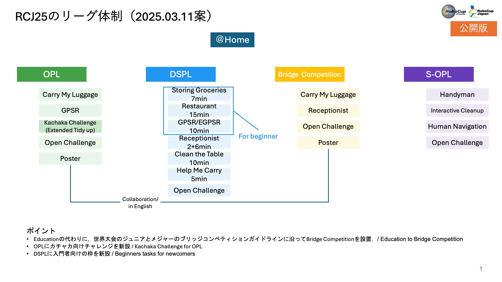

# RoboCup JapanOpen 2025 @Home League

> [!IMPORTANT]
> 実施タスクを公開しました． / Task names are published.

## 大会開催情報

* 大会ウェブページ / Official page: https://www.robocup.or.jp/JapanOpen2025/
* ＠ホームリーグウェブページ / @Home league page: https://sites.google.com/site/robocuphomejapan/japanopen2025
* 競技期間 / Dates: 2025-05-02 - 2025-05-05
* 会場 / Location: 滋賀ダイハツアリーナ / Shiga Daihatsu Arena, Japan

## Discord

＠ホームリーグでは，コミュニケーションツールとしてDiscordを利用しています．  
主に参加者への連絡やチーム内コミュニケーション，チーム同士の連絡に使用されます．＠ホームリーグへの参加を検討しているチームやメンバーの皆様は，ぜひDiscordへ参加してください． 
Discord is the official communication platform for @Home League. There, information towards the participants or communication among teams will be conducted. Any future participant teams and/or members who are planning to join us in this competition are welcome to join the Discord server.

[Discord参加リンク/ Join our Discord server](https://discord.gg/8gJYJqUVZA)

## Tasks

### OPL

ルールはRoboCup2024 World Championship @HomeのRulesbookを基に実施されます．
Rules are based on RoboCup2024 World Championship @Home.

* Carry My Luggage (Education League): [EN](rules/EDU/cml_en.md) / [JA](rules/EDU/cml_ja.md)
* ~~Receptionist~~
* GPSR: [EN](rules/OPL/gpsr_en.md) / [JA](rules/OPL/gpsr_ja.md)
* Open Challenge: [EN](rules/OPL/oc_en.md) / [JA](rules/OPL/oc_ja.md)
* Kachaka Challenge (Extended Tidy Up)[EN](rules/OPL/tu_en.md) / [JA](rules/OPL/tu_ja.md)
* Poster: [EN](rules/OPL/ps_en.md) / [JA](rules/OPL/ps_ja.md)

#### Released Lists

* [Environment List (TODO)](rules/OPL/sd/layout_list.md)
* [Object List](rules/OPL/sd/object_list.md)
* [GPSR - Predefined Location ](rules/OPL/sd/pd_loc_list.md)
* [GPSR - Name List](rules/OPL/sd/name_list.md)
* [GPSR - Question List](rules/OPL/sd/question_list.md)
* [GPSR - Features List](rules/OPL/sd/features_list.md)

### DSPL

Rules are based on RoboCup 2025.
(DSPL競技に関する[QA](https://github.com/RoboCupAtHomeJP/AtHome2025/blob/main/rules/DSPL/qa_dspl_competition.md))

[Schedule](rules/DSPL/README.md)

#### Beginner's (B) Category

ルールや採点方法に変更が加えられる予定です． / Rules and scoring criteria will be modified.

* [Storing Groceries](rules/DSPL/storing_groceries.md)
* [Restaurant](https://github.com/RoboCupAtHomeJP/AtHome2025/blob/main/rules/DSPL/restaurant_for_beginner_league.md)
* [GPSR](https://github.com/RoboCupAtHomeJP/AtHome2025/blob/main/rules/DSPL/gpsr.md)

#### Advanced (A) Category

* Storing Groceries
* [Restaurant](https://github.com/RoboCupAtHomeJP/AtHome2025/blob/main/rules/DSPL/restaurant.md)
* [EGPSR](https://github.com/RoboCupAtHomeJP/AtHome2025/blob/main/rules/DSPL/egpsr.md)
* [Receptionist](https://github.com/RoboCupAtHomeJP/AtHome2025/blob/main/rules/DSPL/receptionist.md)
* Clean the Table
* [Help Me Carry](https://github.com/RoboCupAtHomeJP/AtHome2025/blob/main/rules/DSPL/hmc.md)

#### Object List
* [Object List](rules/DSPL/dspl_2025_object_list.pdf)

#### Name List
* [Name List](rules/DSPL/name_list.md)

#### Question List
* [Question List](rules/DSPL/question_list.md)

#### Posture List
* [Posture List](rules/DSPL/posture_list.md)

### BRG (Bridge Competition)

#### Overall Rules
Rules are based on RoboCup2024 World Championship @Home Playground rules as follows,　
- [Playground Rules 2024](https://drive.google.com/file/d/1CIMQquIntiJZNT4Eg_rq3Nol-29BPBKL/view?usp=drive_link)
- [@Home 2022 Rules](https://drive.google.com/file/d/1yUZBFk4zBO_akltSCd_zbdAvzK5aLwzn/view?usp=drive_link).

#### Tasks
- [Poster Session](rules/EDU/poster_ja.md) 
- [Carry My Luggage](rules/EDU/cml_ja.md)
- [Receptionist](rules/EDU/rc_jp.md)
- [Technical Challenge (Finals)](rules/EDU/finals_jp.md)

### S-OPL

* [General Rules](rules/S-OPL/gr_ja.md)
* [Handyman](rules/S-OPL/hm_ja.md)
* [Interactive Cleanup](rules/S-OPL/ic_ja.md)
* [Human Navigation](rules/S-OPL/hn_ja.md)
* [Open Challenge](rules/S-OPL/tc_ja.md)

