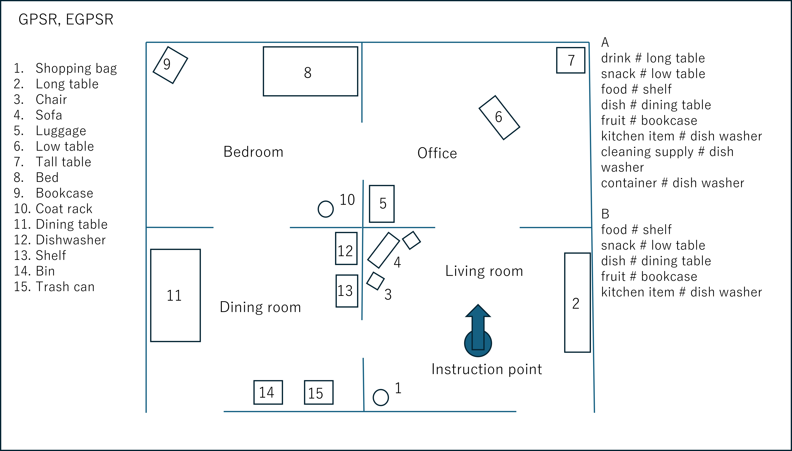

# DSPL

## スケジュール

## task information
### GPSR

## 競技順 (A)
### Receptionist
- TRAIL
- TIDBots
- eR@sers
- Hibikino-Musashi@Home Tamunosuke	
- Re@dy

### Clean The Table
- TIDBots
- eR@sers
- Hibikino-Musashi@Home Tamunosuke	
- Re@dy
- TRAIL

### Restaurant
- TIDBots
- Re@dy
- Hibikino-Musashi@Home Tamunosuke
- TRAIL
- eR@sers

### Help me carry
- eR@sers  
- TIDBots  
- Re@dy  
- Hibikino-Musashi@Home Tamunosuke  
- TRAIL 

### EGPSR
- Hibikino-Musashi@Home Tamunosuke  
- TIDBots  
- eR@sers  
- TRAIL  
- Re@dy  

## 競技順 (B)
### Restaurant
- Robot Dojo
- OIT-R
- iPutok
- SOBITS
- ODENS 

### Storing Groceries
- iPutok
- SOBITS
- Rbot Dojo
- OIT-R
- ODENS

### GPSR
- ~~ODENS~~
- SOBITS  
- iPutok  
- OIT-R  
- ~~Robot Dojo~~

## Score
### Advanced
|         | Robot Inspection | Receptionist | Clean the Table | Restaurant | Help Me Carry | Storing Groceries | EGPSR | Total | Rank | 
| ------- | ---------------- | ------------ | --------------- | ---------- | ------------- | ----------------- | ----- | ----- | ---- | 
| Re@dy   | 100              | 0            | 315             | 200        | 0             | 15                | 0     | 630   | 5    | 
| HMA     | 100              | 500          | 165             | 500        | 500           | 325               | 150   | 2240  | 2    | 
| eR@sers | 100              | 75           | 15              | 600        | 650           | 15                | 150   | 1605  | 4    | 
| TRAIL   | 100              | 670          | 15              | 0          | 500           | 340               | 200   | 1825  | 3    | 
| TIDBots | 100              | 640          | 15              | 220        | 500           | 65                | 800   | 2340  | 1    | 

### Beginner
|            | Robot Inspection (Normalized) | Restaurant (Normalized) | Storing Groceries (Normalized) | GPSR (Normalized) | Normalized Total | Rank | 
| ---------- | ----------------------------- | ----------------------- | ------------------------------ | ----------------- | ---------------- | ---- | 
| Robot Dojo | 100 (1.0)                     | 200 (0.16)              | 615 (1.0)                      | 0 (0.0)           | 2.16             | 3    | 
| OIT-R      | 100 (1.0)                     | 0 (0.0)                 | 65 (0.11)                      | 0 (0.0)           | 1.11             | 4    | 
| SOBITS     | 100 (1.0)                     | 1000 (0.8)              | 80 (0.13)                      | 25 (1.0)          | 2.93             | 1    | 
| iPutok     | 100 (1.0)                     | 1250 (1.0)              | 65 (0.11)                      | 12.5 (0.5)        | 2.61             | 2    | 
| ODENS      | 100 (1.0)                     | 0 (0.0)                 | 15 (0.02)                      | 0 (0.0)           | 1.02             | 5    | 

### Open Challenge
|            | Score | Rank | 
| ---------- | ----- | ---- | 
| HMA        | 59.75 | 3    | 
| Robot Dojo | 52.75 | 5    | 
| TRAIL      | 67    | 1    | 
| OIT-R      | 64.5  | 2    | 
| Re@dy      | 56.5  | 4    |
