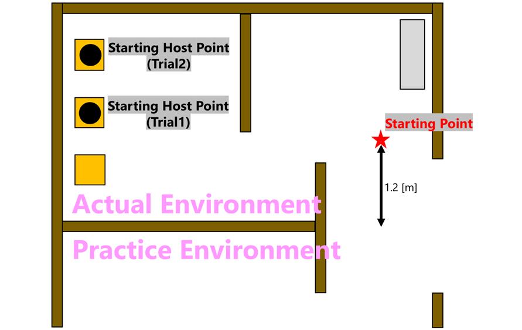
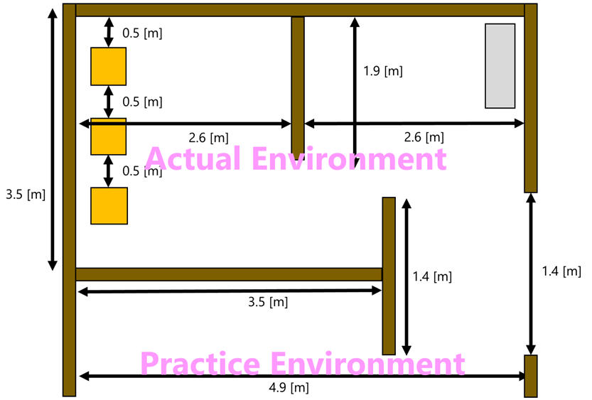

[Japanese(日本語)](./rc_jp.md) | [English(英語)](./rc_en.md)

# Receptionist rule

## Main Goal
In this task, the robot guides two guests to an empty seat in the living room.
The robot introduces the guests to the host.

 

## Focus
System Integration, Human-Robot Interaction, Person Detection, Person Recognition

 

## Setup

- Start Position
  - Robots will start from the ☆ mark (near the entrance of the arena) in the above figure.
- Time
  - Setup : 5 min
  - Competition Time : 7 min
- Host
  - The host's name is Max.
  - His favorite drink is Wine.
  - The initial positions of the hosts are indicated by ● mark in the above figure, respectively, in Trial 1/2.
- Guest
  - Each of the two guests is assigned a name and a favorite beverage.
  - Guests are guided into the room by the robot and introduced.
  - The two guests arrive at different times and come in front of the robot.
  - However, since the timing of the guests' entry is determined by the TC, the robot needs to know that they have entered the room.

 

## Arena

The environment to be used in this project is shown in the figure above.\
The competition will be held without a door.

※However, this is subject to change as we comply with any requests from @Home and RoboCup as a whole regarding the Bridge Competition arena.

 

## Procedure
- Main task（Repeat twice）
  - Detection of the guest
    - Detects and greets guests as they enter the room.
  - Reception
    - The robot asks for the guest's name and favorite drink. 
    - If the robot cannot understand the name or favorite drink, the robot can ask back.
  - Move to the host
    - Move to the location of the host with the guest.
    - For the first person, the location of the host can be known in advance.
  - Introducing Guests
    - The robot introduces the host to the guest by giving the guest's name and favorite beverage.
    - During the introduction, the robot pays attention to the host and the guest being introduced.
  - Guide the guest to an available seat
    - The robot guides the guest to an empty seat and makes the guest sit down.
    - The robot points to the place where the guest can sit (empty seat).
  - Switching Seats
    - After a guest sits down, he/she may be replaced by an empty seat or a host.
    - However, an alternative to fixing the host's position can be chosen
- Bounus task
  - The robot earns bonus points for introducing four features of the first guest to the second guest.

  ※ The acquisition of features cannot be done by voice recognition. In other words, the robot needs to recognize features other than name and favorite drink.

### Task Flow(Movies)
<video src="./layout/RoboCup_BC_Receptionist_TaskFlow.mp4" controls="true"></video>

 

## Local Rules
1. Speech recognition should be done at a distance and in a voice that is audible to both the guest and the host.
2. Interaction between the robot and human should be in English.
3. If the speech of a feature is unclear, a log may be required to be posted.

    ※ Note that if the log cannot be provided, it cannot be confirmed that the robot is speaking correctly, and therefore no points may be awarded.

 

## List of Features

The “feature list” available shall be the following 10.

- Gender  >>  Male or Female
- Clothing color (Tops)  >>  ※
- Pants color  >>  ※
- Hair color  >>  ※
- Length of sleeves  >>  long or short
- Height  >>  ±10cm
- Age  >>  ±7 years old
- Wears Glasses  >>  Yes or No
- Wears Cap/Hat >>  Yes or No
- Wears Mask >>  Yes or No

※To be determined by the scorer.

 

## About list of name and drink
Guests will be randomly assigned a name and a drink of their choice from the list below.

### Name
- Adam
- Axel
- Chris
- Hunter
- Jack
- Paris
- Robin
- Olivia
- William
- Max

### Drink
- orange juice
- coke
- soda
- coffee
- cocoa
- lemonade
- coconut milk
- green tea
- black tea
- wine

 

## Deus Ex Machina

The following deus ex machina will be used in this competition.\
Deus Ex Machina will deduct points, but a simpler technique allows you to skip the action and continue with the task.

|**Action**|**Bypassing**|
|------|-----|
| Host location detection | &nbsp;&bull;&nbsp;Fix it so that it does not change from its initial position. |
| Guest Person Recognition | &nbsp;&bull;&nbsp;Use markers to recognize incoming guests |
| Seat availability detection | &nbsp;&bull;&nbsp;Use markers to detect empty seats |

 
   
## Score Sheet
The highest score between the two trials will be choosen as final result.

|**Action**|**Score**|
|------|-----|
| **Main Tasks** |  |
| 1st Guest | |
| &nbsp;&bull;&nbsp;Great to the Guest | 20 |
| &nbsp;&bull;&nbsp;Move to the Host | 25 |
| &nbsp;&bull;&nbsp;Speak the name of Guest | 50 |
| &nbsp;&bull;&nbsp;Speak the his/her favorite drink | 50 |
| &nbsp;&bull;&nbsp;Direct attention toward the Guest | 40 |
| &nbsp;&bull;&nbsp;Move to the empty seat | 25 |
| &nbsp;&bull;&nbsp;Guide the Guest sitting to empty seat | 30 |
| &nbsp;&bull;&nbsp;Move to the initial point | 30 |
| 2nd Guest | |
| &nbsp;&bull;&nbsp;Great to the Guest | 20 |
| &nbsp;&bull;&nbsp;Move to the Host | **65** |
| &nbsp;&bull;&nbsp;Speak the name of Guest | 50 |
| &nbsp;&bull;&nbsp;Speak the his/her favorite drink | 50 |
| &nbsp;&bull;&nbsp;Direct attention toward the Guest | 40 |
| &nbsp;&bull;&nbsp;Move to the empty seat | **65** |
| &nbsp;&bull;&nbsp;Guide the Guest sitting to empty seat | 30 |
| **Bounus task** |  |
| Speak the features of 1st Guest to 2nd Guest | |
| 1st Feature | 40 |
| 2nd Feature | 40 |
| 3rd Feature | 40 |
| 4th Feature | 40 |
|  |  |
| **Deus Ex Machina**† |  |
| No host location detection | (The second person will have the same score distribution as the first.) |
| Use markers for guest person recognition (each team brings its own markers) | -50 |
| Use markers for vacancy detection(each team brings its own markers) | -50 |
| **Penalty** |  |
| Not attending (absence without permission) | -500 |
|  |  |
| Total Score (including Bounus Task) | 750 |

 

## Instructions by organization comittee
- SetupDay
  - Inform the initial location of the host (Trial1/Trial2 to be published respectively)
- TLM(the previous day)
  - Disclose about the host role
    - If you want to take pictures of the host in advance, etc., you can do so here.
  - Check the section on teams using deus ex machina.
  - Reconfirm initial location of hosts published on Setup Day
- Just before the competition starts (However, the team members cannot know the random factors determined by the management)
  - Finalize with the team whether there are any items to be skipped.
  - Assign the location and name of all guests and their favorite beverage.
  - Indicate the position of the host and guest in the 2nd Guest.

 

## Preparation by each team
- About the referee
  - Each team needs to choose a referee. 
  - All members of each team should go over the rules thoroughly.

 

## Q & A

- What the 'features' may be used?
  - Have each team submit a list of 'features' they would like to use in advance.

- If more than 5 characteristics are mentioned, does the item with the correct answer take precedence?
  - Basically, four of the pre-published list of 'features' should be uttered.
  - It does not matter as long as they are within the list, so the robot may autonomously select them after acquiring multiple features.
    - You do not have to tell the TC/OC in advance.
  - If the robot utters more than 5 features, it will be scored based on the first 4 features it utters, regardless of whether they are correct or incorrect.

- Can own team choose the host and guests?
  - No. Guests are chosen by the TC/OC because the robot must detect the features.

- Can we be told in advance what the layout will be, including chairs?
  

  - Yes, I will consult with CML's OC/TC, but I think the layout will generally look like Fig1.
  - However, this may be subject to change depending on the layout published by @Home.