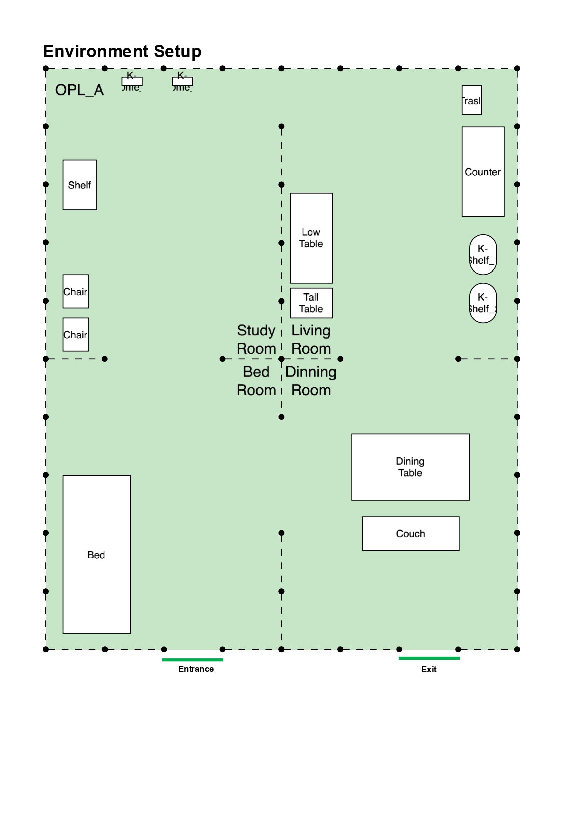
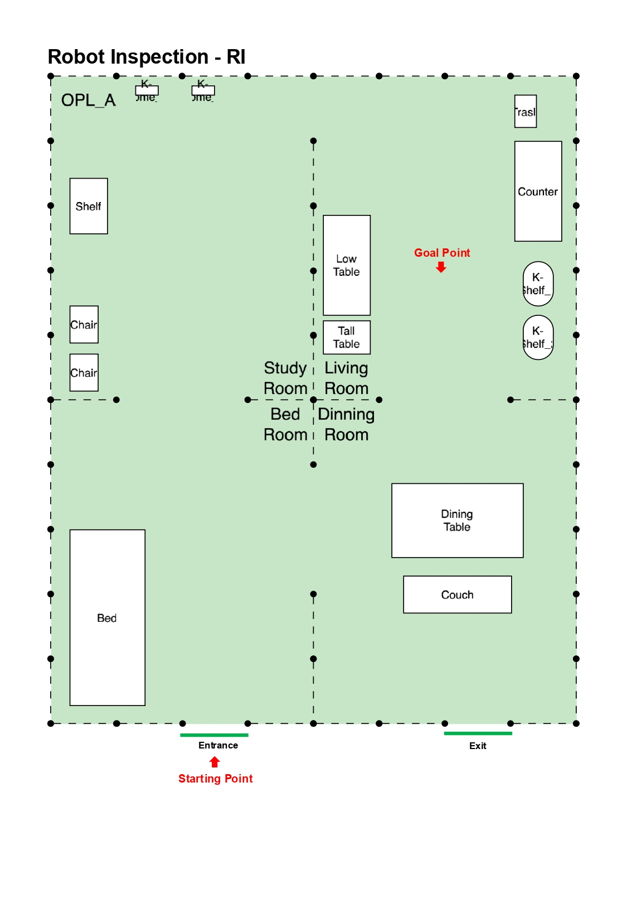
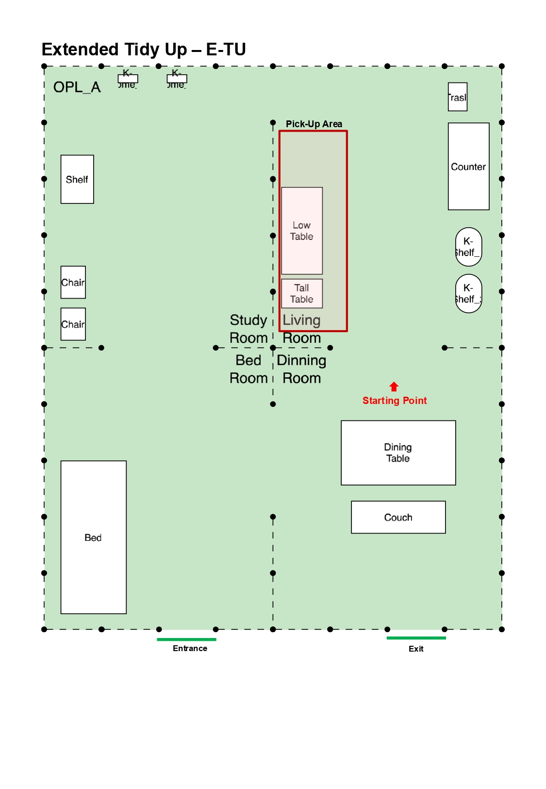
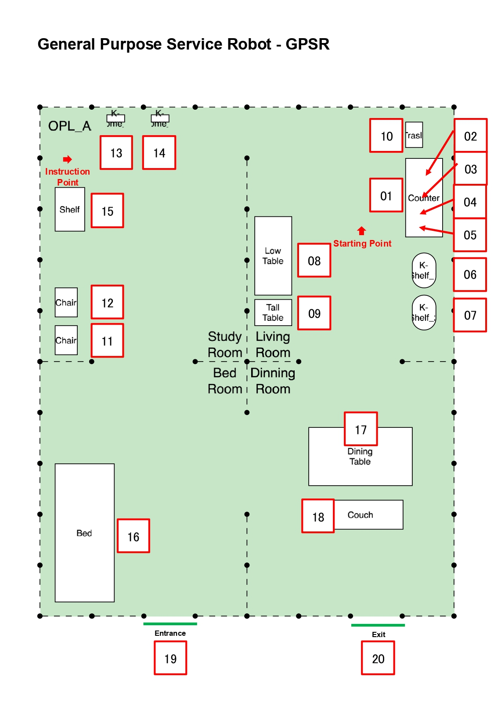
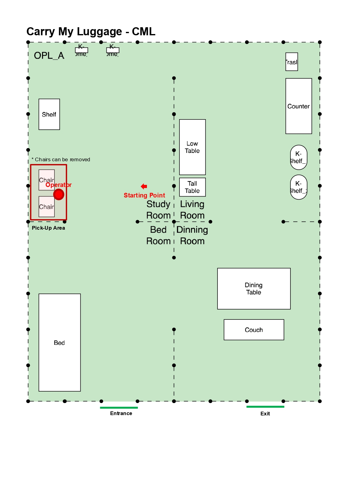

[Go back to README](../../../README_en.md)
[READMEへ戻る](../../../README.md)

# Layout List

> [!WARNING]
> Layout dimensions may differ from the original *Arena*.

## Common Layout

## Robot Inspection - RI ​

## Tidy Up - TU​

## General Purpose Service Robot - GPSR​

## Carry My Luggage - CML​

> [!IMPORTANT]  
> Teams can decide whether to use the chairs, or place the bags in the floor.
> バッグを椅子を使わないで床に置くか，椅子の上に置くか，自由に決められる.
