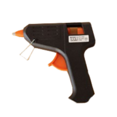

[Go back to README](../../../README.md)
[READMEへ戻る](../../../README.md)

# Object List

## Standard Object List

The *Standard Object List* announced in the latest OPL release will be used. \
公開されている *Standard Object List* (標準オブジェクト)を用いる．

Check it out [here](https://github.com/RoboCupAtHomeJP/AtHome2024/releases/download/v1.0.0-opl/RCJ2024_OPL_Standard_Object_List_v1.0.0.pdf).

| # | Picture | Name | Category |
| --- | --- | --- | --- |
| 01 |  | cookies | Food Item |
| 02 |  | noodles | Food Item |
| 03 |  | potato chips | Food Item |
| 04 |  | detergent | Kitchen Item |
| 05 |  | cup | Kitchen Item |
| 06 |  | lunch box | Kitchen Item |
| 07 |  | dice | Task Item |
| 08 |  | glue gun | Task Item |
| 09 |  | light bulb | Task Item |

## Consistent Object List

| # | Picture | Name | Category |
| --- | --- | --- | --- |
| 01 |  | caramel corn | Food Item |
| 02 |  | sponge | Kitchen Item |
| 03 |  | phone stand | Task Item |

> [!NOTE]
> No *Consistent Object* will be distributed, however they will be available during the practice time.

> [!NOTE]
> *Consistent Object* は配布されないが，チームが予約した練習スロット中に使うことを可能とする．

## Unknown Object

> [!IMPORTANT]
> The *unknown objects* will not be announced.
> *unknown objects* (未知オブジェクト)は公開されない．

## Bag for CML (TODO)

| # | Picture | Name | Category |
| --- | --- | --- | --- |
| 01 |  | Bag | Bag Item |
