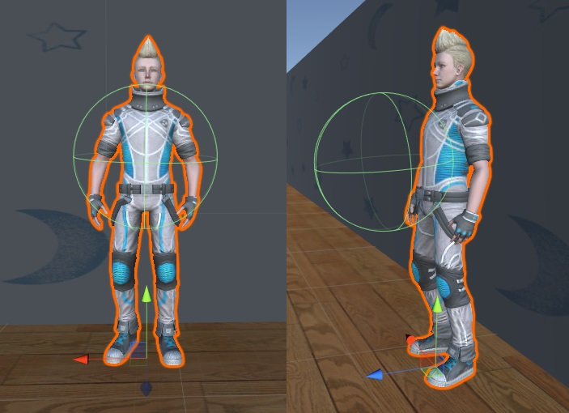

[日本語](./hm_ja.md) | [English](./hm_en.md)

# Handyman (HM)

Reference Video: [Handyman Reference Video](https://youtu.be/VDslaqPwRK4)

> [!NOTE]
> The reference video is not perfect. The task content may vary depending on the rules of the competition year, so please use it only as a reference.  
> If you have any concerns or points for discussion, please write them in the [Issues](https://github.com/RoboCupAtHomeJP/AtHome2025/issues) section on GitHub.

## Overview

This task evaluates the basic capabilities of robots to support human daily life. The task involves exploring, grasping, and transporting objects based on given instructions. It focuses on understanding instructions, autonomous navigation considering obstacles, object recognition, object manipulation, human detection, and task planning.  
Additionally, if the instructions are incorrect, such as asking the robot to search for a non-existent object, the robot is required to detect and point out the error.

## Setup
- **System Configuration**: 
  - This competition involves communication via a rosbridge server between a Windows PC running the simulation environment and an Ubuntu PC running the robot controller developed by each team. This enables the robot to acquire sensor data and interact with the avatar.
- **Handyman-Windows**: 
  - On the Windows PC running the simulation environment, Handyman software based on Unity and SIGVerse is executed. This software sends JointState, TF, sensor information, and other ROS messages to the robot controller at regular intervals. Setup instructions can be found [here](https://github.com/RoboCupatHomeSim/handyman-unity).
- **Robot Controller-Ubuntu**: 
  - Each team develops a robot control program for the Handyman task in an Ubuntu environment. The robot is controlled by sending Twist, JointTrajectory, and other ROS messages. Setup instructions for the Ubuntu environment can be found [here](https://wiki.ros.org/noetic/Installation/Ubuntu).

## Competition Flow
The competition proceeds as follows:

1. Team members start the SIGVerse ROSBridge server and the robot controller.

2. The Organizational Committee (OC) starts the Handyman program.

3. The positions and orientations of the robot and the objects to be grasped are initialized.

4. The moderator sends the "Are_you_ready?" message to the robot. At the same time, the "Environment" message is sent.

5. The robot sends the "I_am_ready" message to the moderator.

6. The moderator sends the "Instruction" message to the robot. (Example: "Go to XXXX, grasp YYYY, and bring it here.")

7. The robot moves to the room where the target object is located and sends the "Room_reached" message to the moderator.  
    - If the robot successfully moves to the correct room, points are awarded.  
    - If the robot moves to the wrong room, the session ends.  

8. The robot searches for the object.  
    - If the robot cannot find the target object and determines that it does not exist, it sends the "Does_not_exist" message to the moderator.  
      - If the instruction is correct, points are awarded, and the moderator sends the "Corrected_instruction" message to the robot. The robot must then search for a new object.  
      - If the instruction is incorrect, the session ends.  

9. The robot grasps the object. If successful, it sends the "Object_grasped" message to the moderator.  

10. The moderator verifies whether the grasped object is correct.  
    - If the object is correct, points are awarded.  
    - If the object is incorrect, the session ends.  

11. The robot transports the object to the destination.  
    - If the object is transported to the correct location, points are awarded.  
    - If the object is transported to the wrong location, the session ends.  

12. The robot sends the "Task_finished" message to the moderator.

Each session ends with one of the following events:
- **If the target object is placed at the destination**:
  - The moderator sends the "Task_succeeded" message to the robot.
- **If the robot controller sends "Give_up"**:
  - If the task cannot be completed, the robot can send the "Give_up" message.
  - In this case, the session is interrupted, and the moderator sends the "Task_failed" message to the robot.
- **If the time runs out**:
  - The moderator sends the "Task_failed" message to the robot.
- **If no sessions remain**:
  - The moderator sends the "Mission_complete" message to the robot, ending the competition.
- **If sessions remain**:
  - Return to step 3.

> [!Tip]
> For more details, please refer to the [wiki](https://github.com/RoboCupatHomeSim/handyman-unity/wiki/SystemOverview) on GitHub.

## Number of Sessions and Time Limit
The task consists of **6** sessions, with a time limit of **10** minutes per session.  
The timer starts when the TC clicks the start button.

## Score Sheet

<table>
  <tr>
    <th> <b>Action</b> </th>
    <th> <b>Score</b> </th>
  </tr>
  <tr>
    <td colspan="2" align="center"> <b>Main Task</b> </td>
  </tr>
  <tr>
    <td> Move to the instructed room <br> 
    Grasp the instructed object <br> 
    Transport the object to the instructed location <br>
    </td>
    <td align="center"> 20 <br> 50 <br> 30 </td>
  </tr>
  <tr>
    <td colspan="2" align="center"> <b>Bonus Points</b> </td>
  </tr>
  <tr>
    <td> Detect and propose corrections for instruction errors
    </td>
    <td align="center"> 50 </td>
  </tr>
  <tr>
    <td colspan="2" align="center"> <b>Penalties</b> </td>
  </tr>
  <tr>
    <td> Move to the wrong room <br>
    Grasp the wrong object <br>
    Incorrectly point out instruction errors <br>
    Collide with the avatar or objects <br>
    Grasped/released objects collide with other objects <br>
    </td>
    <td align="center"> -10 <br> -10 <br> -10 <br> 0 <br> 0 </td>
  </tr>
  <tr>
    <td> <b>Total Score (excluding penalties and bonuses) (per session)</b> </td>
    <td align="center"> <b>100</b> </td>
  </tr>
</table>

## Referee (TC) Actions
- Gather 30 minutes before the competition starts to check connections with the competitors.
- Score the competition based on the score sheet.
- Verify the scoring with other TCs.
- Submit the score sheet.

> [!NOTE]
> TCs are selected from each team and will perform the above tasks for other teams' competitions.

## Remarks

### Instructions to the Robot
The instructions are written in English natural language as text (ASCII character strings). The instructions always include actions such as moving, grasping, and transporting.  
"Go to the XXX, grasp the YYY, and ZZZ."  
Here, `XXX` is the destination room, `YYY` is the target object to grasp, and `ZZZ` indicates the transportation action and destination. The transportation action consists of one of the following:  
1. Place the object at a specific location.  
2. Dispose of the object in a trash bin.  
3. Hand the object to the avatar.  

To express these target locations, the following candidate phrases can be used:  
```
next to the x
on the x
in the x
under the x
close to the x
between x and y
in front of x
```  
`x` and `y` are landmarks, preferably names of objects or furniture. The landmarks can be either graspable or non-graspable objects. These candidate phrases (prepositions and spatial relationships) may be expanded or revised during the English proofreading process by native speakers.

### Object Transportation
The instructions may require the robot to hand the target object to the avatar. To perform the handover action, the robot must extend the arm holding the target object to the avatar's chest. The end effector must be within a sphere with a 30cm radius centered on the avatar's chest.  
If the instruction requires transporting the object to a destination instead of handing it over, the robot must place the object without causing significant impact.

<div align="center"></div>

### Dynamic Environmental Changes
Unrelated avatars may move within the environment, independent of the instructions given to the robot. Additionally, the avatar that issued the instructions may walk around after giving them. The robot must distinguish unrelated avatars.  
The positions of furniture such as desks, tables, and chairs are fixed, but the position of the trash bin may differ from the layout file provided.  
The object specified by the avatar may not exist. In this case, the robot must confirm that the object is not at the specified location and point out its absence. By pointing out errors in the instructions, the avatar can correct the instructions, and the team can earn additional points.