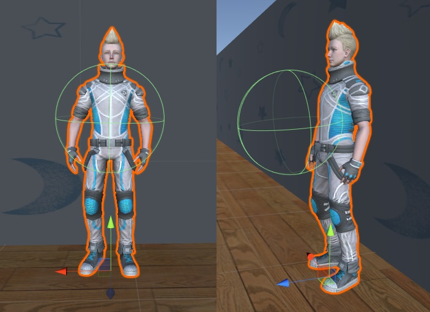

[日本語](./hm_ja.md) | [English](./hm_en.md)

# Handyman（HM）

参考動画：[Handyman参考動画](https://youtu.be/VDslaqPwRK4)

> [!NOTE]
> 参考動画は完璧ではありません．開催年度のルールによってタスク内容が異なる可能性があるので，あくまで参考程度にしてください．
> 気になる点や議論したい点などがありましたら，GitHubの[Issues](https://github.com/RoboCupAtHomeJP/AtHome2025/issues)にてご記入ください．


## 概要

このタスクでは，人間の日常生活をサポートするロボットの基本的な能力を評価します．タスクの内容は，与えられた指示に従って物体を探索，把持，運搬することです．このタスクは，命令文の内容理解，障害物を考慮した自律移動，物体認識，物体操作，人物検出，タスクプランニングなどに焦点を当てています．
加えて，存在しない物体を探す指示のように命令文が誤っている場合には，その誤りを検知し指摘することが求められます．

## セットアップ
- **システム構成**：
  - 本競技ではシミュレーション環境を実行するWindows PCと，各チームが開発するロボットコントローラを実行するUbuntu PCでrosbridge serverを介した通信を行う．これにより，ロボットのセンサデータの取得や，アバターとロボットのインタラクションを行う．
- **Handyman-Windows**：
  - シミュレーション環境を実行するWindows PCでは，UnityとSIGVerseをベースにHandymanソフトウェアを実行する．このソフトウェアは，JointState，TF，センサー情報，その他のROSメッセージを一定間隔でロボットコントローラに送信する．セットアップ手順は[こちら](https://github.com/RoboCupatHomeSim/handyman-unity)
- **ロボットコントローラ-Ubuntu**：
  - 各チームはUbuntu環境において，Handymanタスクを行うためのロボット制御プログラムの開発を行う．TwistやJointTrajectory，その他のROSメッセージを送信することでロボットを制御する．Ubuntu環境のセットアップ手順は[こちら](https://wiki.ros.org/noetic/Installation/Ubuntu)

## 競技の構成
競技の流れは以下の通りです．

1. チームメンバーがSIGVerse ROSBridgeサーバ，ロボットコントローラを起動する．

2. 技術委員(OC)がHandyman プログラムを起動する．

3. ロボットと把持するオブジェクトの位置・姿勢を初期化する．

4. モデレータがロボットに"Are_you_ready?"メッセージを送信する．同時に，"Environment"メッセージが送信される．

5. ロボットがモデレータに"I_am_ready"メッセージを送信する．

6. モデレータがロボットに"Instraction"メッセージを送信する．（例: XXXXに行き，YYYYを掴んでここに持ってきてください．）

7. ロボットは支持に従って目的の物体がある部屋に移動し，"Room_reached"メッセージをモデレータに送信する．
    - 目的の部屋に移動（成功）した場合，ポイントが加点される．
    - 誤った部屋に移動（失敗）した場合，セッションを終了する．

8. ロボットは物体を探す．
    - ロボットが目標物体を見つけることができず、物体が存在しないと判断した場合、ロボットはモデレータに "Does_not_exist"メッセージを送信する．
      - 指示が正しい場合，ポイントが加点され、モデレータは"Corrected_instruction"メッセージをロボットに送信する．その後，ロボットは新しいオブジェクトを探す必要がある．
      - 指示が正しくない場合，セッションを終了する．

9. ロボットは物体を掴む．掴むのに成功した場合，"Object_grasped"メッセージをモデレータに送信する．

10. モデレータは掴んだ物体が正しいかどうかを確認する．
    - 正しい物体を把持（成功）した場合，ポイントが加算される
    - 誤った物体を把持（失敗）した場合，セッションを終了する．

11. ロボットは物体を目的地に運ぶ．
    - 正しい位置に運搬（成功）した場合，ポイントが加算される
    - 誤った位置に運搬（失敗）した場合，セッションを終了する．

12. ロボットは"Task_finished"メッセージをモデレータに送信する．

各セッションは以下のイベントによって終了する．
- **目標物が目的地に設置される場合**:
  - モデレータからロボットに"Task_succeeded"が送信される．
- **ロボットから"Give_up"が送信される場合**:
  - タスクが達成できない場合，ロボットは"Give_up"メッセージを送ることができる．
  - その場合，セッションは中断され，モデレータは"Task_failed"メッセージをロボットに送信する．
- **時間切れの場合**:
  - モデレータはロボットに"Task_failed"メッセージを送信する．
- **セッションが残っていない場合**:
  - モデレータはロボットに"Mission_complete"メッセージを送信し，競技を終了する．
- **セッションが残っている場合**:
  - ステップ3に戻る．

> [!Tip]
> 詳細はGithubの[wiki](https://github.com/RoboCupatHomeSim/handyman-unity/wiki/SystemOverview)を参照してください．

## セッション数と制限時間
タスクは**6**セッションで構成され，各セッションの制限時間は**10**分です．
タイマーは，OCがスタートボタンをクリックした時点で開始されます．

## スコアシート（Score Sheet）

<table>
  <tr>
    <th> <b>Action</b> </th>
    <th> <b>Score</b> </th>
  </tr>
  <tr>
    <td colspan="2" align="center"> <b>メインタスク</b> </td>
  </tr>
  <tr>
    <td> 指示された部屋に移動する <br> 
    指示された物体を把持する <br> 
    物体を指示通りの位置に運搬する <br>
    </td>
    <td align="center"> 20 <br> 50 <br> 30 </td>
  </tr>
  <tr>
    <td colspan="2" align="center"> <b> ボーナスポイント </b> </td>
  </tr>
  <tr>
    <td> 指示文章のミスを発見し修正を提案する
    </td>
    <td align="center"> 50 </td>
  </tr>
  <tr>
    <td colspan="2" align="center"> <b> ペナルティ </b> </td>
  </tr>
  <tr>
    <td> 誤った部屋に移動する <br>
    誤った物体を把持する <br>
    誤って指示文章のミスを指摘する <br>
    アバターや物体に衝突する <br>
    把持・手放した物体が他の物体と衝突する <br>
    </td>
    <td align="center"> -10 <br> -10 <br> -10 <br> 0 <br> 0 </td>
  </tr>
  <tr>
    <td> <b>総得点 (ペナルティ，ボーナスを除く) （1セッション当たり）</b> </td>
    <td align="center"> <b>100</b> </td>
  </tr>
</table>

## レフェリー(OC)の動き
- 競技開始30分前に集まり，競技者とともに接続確認を行う．
- スコアシートに基づき，競技を採点する．
- 他のOCと採点内容を確認し合う．
- スコアシートを提出する．

> [!NOTE]
> OCは各チームから数名選出され，他チームの競技において上記を行ってもらう．


## 備考

### ロボットへの指示
指示文は，英語の自然言語表現として，テキスト（ASCII文字の列）で記述されます．指示には，次のような移動，把持，運搬の動作が必ず含まれます．
"Go to the XXX， grasp the YYY and ZZZ，"
この際，`XXX`は移動先となる部屋，`YYY`は把持対象物，`ZZZ`は運搬行動と運搬先を示します．運搬行動は以下のいずれかで構成されます：  
1. 対象物を特定の場所に置く．  
2. 対象物をゴミ箱に捨てる．
3. 対象物をアバターに手渡す．

それらの目標位置を表現するために，以下の候補フレーズを使用することができます．
```
next to the x
on the x
in the x
under the x
close to the x
between x and y
in front of x
```
`x`と`y`は物体のランドマークであり，物や家具の名前であることが望ましいです．対象物の目印は，把握可能な物でも把握不可能な物でも問題ありません．これらの候補フレーズ（前置詞と空間関係）は，英語ネイティブスピーカーによる英語添削の過程で，増えたり修正されたりする場合があります．

### 物体の運搬動作
指示文は，アバターに対象物を渡すことを要求している場合があります．手渡し動作を行うために，ロボットは指示物体を把持しているアームをアバターの胸元まで伸ばす必要があります．その際，エンドエフェクタはアバターの胸を中心位置とする半径30cmの球の中にいる必要があります．
手渡しではなく目的地まで運ぶ動作が指示されている場合は，大きな衝撃を与えないように目的地に置く必要があります．

<div align="center"></div>

### ダイナミックな環境の変化
ロボットへの指示とは関係のない別のアバターが，環境内で移動していることがあります．また，ロボットに指示を出したアバターも，指示後に歩き回ることがあります．ロボットは無関係なアバターを区別する必要があります．
机，テーブル，椅子などの家具の位置は固定されていますが，ゴミ箱の位置は公開される部屋のレイアウトファイルの位置と異なる場合があります．
アバターが指示した対象物が存在しない場合もあります．この場合，ロボットは物体が指定の位置にないことを確認し，その物体が存在していないことを指摘する必要があります．指示文の間違いを指摘によりアバターはその指示文を修正し，追加で得点を得ることができます．
