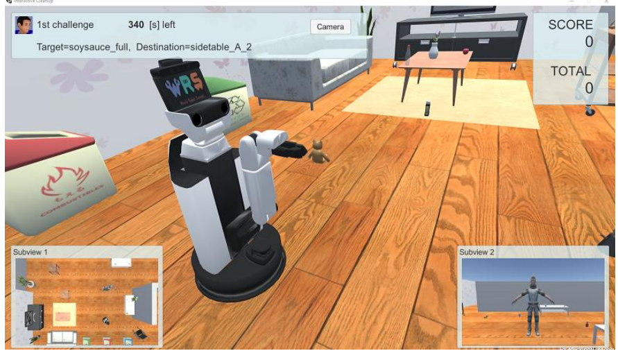
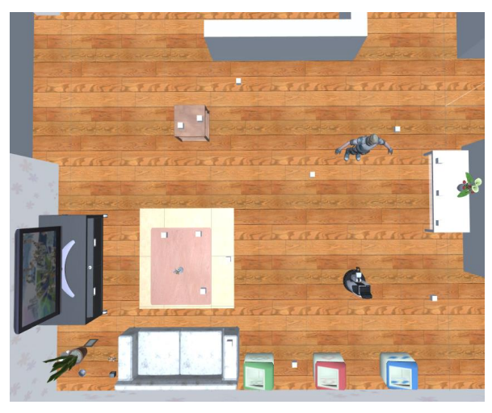
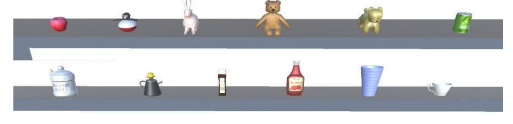
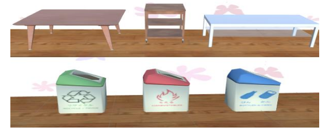

[日本語](./ic_ja.md) | [English](./ic_en.md)

# Interactive Cleanup (IC)

Reference Video: [Interactive Cleanup Reference Video](https://youtu.be/HHMxg-a5puo)

> [!NOTE]
> The reference video is not perfect. The task content may vary depending on the rules of the competition year, so please use it only as a reference.  
> If you have any concerns or points for discussion, please write them in the [Issues](https://github.com/RoboCupAtHomeJP/AtHome2025/issues) section on GitHub.

## Overview
This task evaluates the robot's ability to understand pointing gestures. Similar to the Handyman task, it requires basic functionalities such as obstacle-avoidance navigation, object recognition, object manipulation, and human detection. Additionally, the robot must pay attention not only to the instructions but also to the actions of the human avatar. The pointing gestures are distributed fairly among all teams, and multiple sessions are repeated to statistically evaluate the robot's performance.

## Setup
- **System Configuration**:
  - This competition involves communication via a rosbridge server between a Windows PC running the simulation environment and an Ubuntu PC running the robot controller developed by each team. This enables the robot to acquire sensor data and interact with the avatar.
- **Interactive Cleanup - Windows**:
  - On the Windows PC running the simulation environment, Human Navigation software based on Unity and SIGVerse is executed. This software sends JointState, TF, sensor information, and other ROS messages to the robot controller at regular intervals. Setup instructions can be found [here](https://github.com/RoboCupatHomeSim/interactive-cleanup-unity).
- **Robot Controller - Ubuntu**:
  - Each team develops a robot control program for the Human Navigation task in an Ubuntu environment. The robot is controlled by sending Twist, JointTrajectory, and other ROS messages. Setup instructions for the Ubuntu environment can be found [here](https://wiki.ros.org/noetic/Installation/Ubuntu).

## Competition Flow
The competition proceeds as follows:

1. Team members start the SIGVerse ROSBridge server and the robot controller.

2. The Organizational Committee (OC) starts the Interactive Cleanup program.

3. The positions and orientations of the robot and the objects to be grasped are initialized.

4. The moderator sends the "Are_you_ready?" message to the robot.

5. The robot sends the "I_am_ready" message to the moderator.

6. The avatar moves and points to the object that the robot should grasp. At this time, the moderator sends the "Pick_it_up!" message to the robot.

7. The avatar moves and points to the location where the object should be placed. At this time, the moderator sends the "Clean_up!" message to the robot.

8. The avatar returns to its initial position.

9. The robot can optionally request a repeat of the pointing gesture.
    - If the robot sends the "Point_it_again" message, this step is repeated (re-instruction).

10. The robot moves and grasps the target object.

11. The robot can optionally confirm whether the object is correct.
    - After grasping the object, the robot sends the "Is_this_correct?" message, and the avatar responds with "Yes/No." However, points are deducted for each confirmation.

12. The robot sends the "Object_grasped" message to the avatar, and if the object is correct, points are awarded.

13. The robot moves and places the object at the target location.

14. The robot sends the "Task_finished" message to the moderator.

15. Each session ends with one of the following events:
    - **If the target object is placed at the destination**:
      - The moderator sends the "Task_succeeded" message to the robot.
    - **If the robot sends "Give_up"**:
      - If the task cannot be completed, the robot can send the "Give_up" message.
      - In this case, the session is interrupted, and the moderator sends the "Task_failed" message to the robot.
    - **If the time runs out**:
      - The moderator sends the "Task_failed" message to the robot.
    - **If no sessions remain**:
      - The moderator sends the "Mission_complete" message to the robot, ending the competition.
    - **If sessions remain**:
      - Return to step 3.

> [!Tip]
> For more details, please refer to the [wiki](https://github.com/RoboCupatHomeSim/interactive-cleanup-unity/wiki/SystemOverview) on GitHub.

## Number of Sessions and Time Limit
The task consists of **10** sessions, with a time limit of **6** minutes per session.  
The timer starts when sensor information is distributed to the robot.

## Score Sheet

<table>
  <tr>
    <th> <b>Action</b> </th>
    <th> <b>Score</b> </th>
  </tr>
  <tr>
    <td colspan="2" align="center"> <b>Main Task</b> </td>
  </tr>
  <tr>
    <td> The robot correctly grasps the target object   
      The robot successfully disposes of or relocates the target object  
    </td>
    <td align="center"> 50   50 </td>
  </tr>
  <tr>
    <td colspan="2" align="center"> <b> Penalties </b> </td>
  </tr>
  <tr>
    <td>The robot incorrectly grasps the target object 
    The robot incorrectly disposes of or relocates the target object 
    The robot confirms the correctness of the object (per instance) 
    The robot collides with an object (per instance) 
    The robot's grasped/released object collides with other objects (per instance) 
    The robot requests a repeat of the pointing gesture (per instance)
    </td>
    <td align="center"> -10   -10   -10   -10   0   0 </td>
  </tr>
  <tr>
    <td> <b>Total Score (excluding penalties and bonuses) (per session)</b> </td>
    <td align="center"> <b>100</b> </td>
  </tr>
</table>

The session score is calculated as the sum of the above scores during the session. If excessive penalties result in a session score below zero, the session is treated as zero points. The total score for Interactive Cleanup is the sum of all session scores.

## Competition Screen
An example of the competition screen in Unity is shown below.  

The meaning of each component can be found in the [wiki](https://github.com/RoboCupatHomeSim/interactive-cleanup-unity/wiki/Screen) on GitHub.

## Room Layout
An example of the room used in this competition is shown below.  

## Target Objects
Examples of objects to be grasped by the robot are shown below. The final list of candidate objects will be announced 14 days before the competition.  

## Destinations (Object Placement Locations)
The avatar indicates the destination of the target object with the second pointing gesture. Destinations are either on furniture or inside a trash bin. Examples of destinations used in the task are shown below. The list of destination objects will be announced 14 days before the competition.  

## Referee (OC) Actions
- Gather 30 minutes before the competition starts to check connections with the competitors.
- Score the competition based on the score sheet.
- Verify the scoring with other OCs.
- Submit the score sheet.

> [!NOTE]
> OCs are selected from each team and will perform the above tasks for other teams' competitions.

## Remarks

### Pointing Gestures
The avatar performs two pointing gestures. The first gesture identifies the target object to be grasped, and the second gesture identifies its destination. The avatar maintains each posture/gesture for n seconds. The avatar always uses its index finger for pointing gestures. The direction of the pointing gesture is determined randomly for each session. The duration of the pause ranges from 2 ≤ n ≤ 10 seconds.

### Robot and Avatar
The initial positions of the robot and avatar are always the same for all sessions. The robot's initial posture is set so that it can capture the human avatar image using `HeadCenterCamera`.
